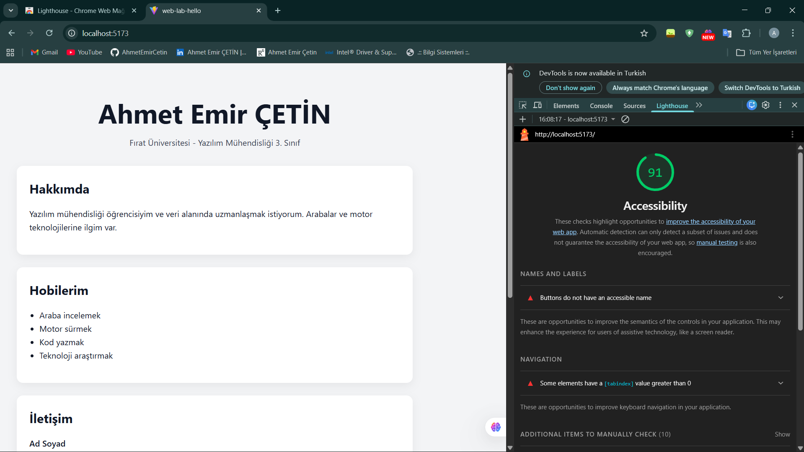

# Web Tasarımı ve Programlama - LAB 2

## 👤 Öğrenci Bilgileri

- **Ad Soyad:** Ahmet Emir ÇETİN
- **Öğrenci No:** 235542012
- **Bölüm:** Yazılım Mühendisliği
- **Üniversite:** Fırat Üniversitesi

---

## 📌 Proje Açıklaması

Bu proje, React + TypeScript kullanılarak geliştirilmiş kişisel web sayfasıdır.  
Proje kapsamında temel React yapısı oluşturulmuş, bileşen mantığı kullanılmış ve form yönetimi gerçekleştirilmiştir.

---

## 🚀 Kullanılan Teknolojiler

- React
- TypeScript
- Vite
- CSS
- Git & GitHub

---

## 🏗 Yapılan İşlemler

### 1️⃣ Proje Kurulumu
- Vite kullanılarak React + TypeScript projesi oluşturuldu.
- Gerekli bağımlılıklar yüklendi.
- Proje yapısı düzenlendi.

---

### 2️⃣ Sayfa Yapısı (Semantic HTML)

Aşağıdaki yapılar kullanılmıştır:

- `<main>`
- `<header>`
- `<section>`
- `<footer>`

Bu sayede sayfa semantic olarak düzenlenmiş ve SEO uyumlu hale getirilmiştir.

---

### 3️⃣ İçerik Bölümleri

Sayfa aşağıdaki bölümlerden oluşmaktadır:

- Kişisel Bilgiler
- Hakkımda Bölümü
- Hobiler Listesi
- İletişim Formu

---

### 4️⃣ İletişim Formu

Form bölümünde:

- useState ile state yönetimi yapılmıştır.
- Controlled component yapısı kullanılmıştır.
- `onChange` ve `onSubmit` eventleri tanımlanmıştır.
- `required` attribute ile doğrulama eklenmiştir.
- Label-input bağlantısı kurulmuştur (Accessibility için).

---

### 5️⃣ CSS Düzenlemeleri

- Ayrı bir `App.css` dosyası oluşturulmuştur.
- Responsive tasarım eklenmiştir.
- Kontrast oranı iyileştirilmiştir.
- Focus state eklenmiştir.
- Kart (card) tasarımı uygulanmıştır.

---

### 6️⃣ Lighthouse Optimizasyonu

Proje Lighthouse testine tabi tutulmuştur.

İyileştirmeler:

- Semantic yapı güçlendirildi
- Aria ve accessibility özellikleri eklendi
- Autocomplete attribute eklendi
- Meta description ve title tanımlandı
- Responsive yapı geliştirildi

Hedef: Lighthouse skorunun 90 ve üzeri olması.

---

## 🔀 Git Süreci

- Feature branch oluşturuldu
- TSX ve CSS değişiklikleri ayrı commit'lerde yapıldı
- Conventional commit mesaj formatı kullanıldı
  - feat:
  - style:
  - docs:

---

## ▶️ Projeyi Çalıştırma

```bash
npm install
npm run dev
```
